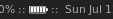
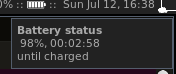
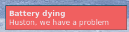

## Battery widget
Simple and easy-to-install widget for Awesome Window Manager.

This widget consists of 

 - an icon which shows the battery status: 
 - a pop-up window, which shows up when you hover over it: 
 - a pop-up warning message which appears when battery level is less that 15%:  

## Installation

This widget uses the output of acpi tool.
- install `acpi` tool:
```
sudo apt-get install acpi
```
- clone/copy battery.lua file and battery-icons folder to your ~/home/username/.config/awesome/ folder;

- change path to the icons in `battery.lua`;

- include `battery.lua` and add battery widget to your wibox in rc.lua:
```
require("battery")
...
right_layout:add(batteryIcon)
```
