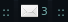

This widget consists of an icon with counter which shows number of unread emails: 
and a popup message which appears when mouse hovers over an icon: 

## Installation

To install it either clone [EmailWidget](https://github.com/streetturtle/AwesomeWM/tree/master/EmailWidget) project under `~/.config/awesome/` or download a .zip archive and unzip it there.

After provide your credentials in python scripts so that they could connect to server and add following lines in your **rc.lua** file:

```lua
require("email")
...
right_layout:add(emailWidget_icon)
right_layout:add(emailWidget_counter)
```

## How it works

This widget uses the output of two python scripts, first is called every 5 seconds - it returns number of unread emails and second is called when mouse hovers over an icon and displays content of those emails. For both of them you'll need to provide your credentials and imap server. For testing they can simply be called from console:

``` bash
python ~/.config/awesome/email/countUnreadEmails.py 
python ~/.config/awesome/email/readEmails.py 
```

Note that getting number of unread emails could take some time, so instead of `pread` or `spawn_with_shell` functions I use DBus, you can read more about it in [this]({{site.url}}/2015/09/fix-awesome-freezes) post.
