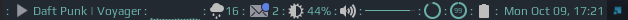

<p align="center">
 
</p>

<p align="center">
  
  
</p>

[](http://hits.dwyl.io/Streetturtle/Awesome-wm-widgets)

Set of super simple widgets compatible with Awesome Window Manager v.4+. 

## Screenshots 

Spotify, CPU, RAM, brightness-arc, volume-arc and battery-arc widgets:

<p align="center">
 
</p>

Brightness, volume and battery widgets:

<p align="center">
 
</p>


or with separators



Some more screenshots in this reddit [post](https://www.reddit.com/r/unixporn/comments/8qijmx/awesomewm_dark_theme/)

From left to right:

- [spotify-widget](https://github.com/streetturtle/AwesomeWM/tree/master/spotify-widget) / [rhythmbox-widget](https://github.com/streetturtle/AwesomeWM/tree/master/rhythmbox-widget)
- [cpu-widget](https://github.com/streetturtle/AwesomeWM/tree/master/cpu-widget) 
- [weather-widget](https://github.com/streetturtle/AwesomeWM/tree/master/weather-widget)
- [email-widget](https://github.com/streetturtle/AwesomeWM/tree/master/email-widget)
- [brightness-widget](https://github.com/streetturtle/AwesomeWM/tree/master/brightness-widget)
- [volume-widget](https://github.com/streetturtle/AwesomeWM/tree/master/volume-widget)
- [volumebar-widget](https://github.com/streetturtle/AwesomeWM/tree/master/volumebar-widget) 
- [volumearc-widget](https://github.com/streetturtle/AwesomeWM/tree/master/volumearc-widget) 
- [batteryarc-widget](https://github.com/streetturtle/AwesomeWM/tree/master/batteryarc-widget) 
- [battery-widget](https://github.com/streetturtle/AwesomeWM/tree/master/battery-widget)
- [ram-widget](https://github.com/streetturtle/AwesomeWM/tree/master/ram-widget)
- [translate-widget](https://github.com/streetturtle/AwesomeWM/tree/master/translate-widget) (not on the screenshot)
- [spotify-shell](https://github.com/streetturtle/AwesomeWM/tree/master/spotify-shell) (not on the screenshot)
- [run-shell](https://github.com/streetturtle/AwesomeWM/tree/master/run-shell) (not on the screenshot)

Some of these widgets use [Arc icon theme](https://github.com/horst3180/arc-icon-theme) by default but it could be easily 
changed to any other icon theme or custom icons. If you want to have separators between widgets like on the screenshot create text widget with ` : ` and place it between widgets:

```lua
...
sprtr = wibox.widget.textbox()
sprtr:set_text(" : ")
...
sprtr,
volume_icon,
sprtr,
battery_widget,
sprtr,
...
```

# Installation

Clone the repo under **~/.config/awesome/**, then in **rc.lua** add the import of the widget you'd like to use in "require" section on the top of the file:

```lua
local battery_widget = require("awesome-wm-widgets.battery-widget.battery")
```

and then add widget to the wibox (you can search for **mytextclock** and add widget before):

```lua
 -- Add widgets to the wibox
     s.mywibox:setup {
         layout = wibox.layout.align.horizontal,
         { -- Left widgets
         ...
         },
         s.mytasklist, -- Middle widget
         { -- Right widgets
         ...
             battery_widget,
             mytextclock
         ...
         }
```

You will also need to install [Arc icon theme](https://github.com/horst3180/arc-icon-theme) if widget uses icons. By default it should be installed under **/usr/share/icons/Arc**. If you prefer different installation folder then you'll have to change path to the icons in the source code of the widget you want to use.

# Icons

If you don't want to install Arc icon theme you can just download the icons which are used from the [Arc repository](https://github.com/horst3180/arc-theme).
Or create your own icons with the same name.

In case of any questions/suggestions don't hesitate to contact me, I would be happy to help :)

PRs/issues and st★rs are welcome!

# Stargazers

[](https://starchart.cc/streetturtle/awesome-wm-widgets)
