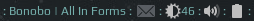

 

  
  
  
  
  
  

Set of widgets compatible with Awesome Window Manager v.4.3+.

## Screenshots

Spotify, CPU, RAM, brightness-arc, volume-arc and battery-arc widgets:

 

Brightness, volume and battery widgets:

 

Some more screenshots in this reddit [post](https://www.reddit.com/r/unixporn/comments/8qijmx/awesomewm_dark_theme/)

# Installation

Clone the repo under **~/.config/awesome/**, then follow an Installation section of widget's readme file.

# Stargazers

# Troubleshooting

In case of any doubts/questions/problems:
 - create an [issue](https://github.com/streetturtle/awesome-wm-widgets/issues/new/choose)
 - raise a question on [Discussions](https://github.com/streetturtle/awesome-wm-widgets/discussions)!
 - ping me on AwesomeWM's discord, here's an [invite](https://discord.gg/BPat4F87dg)

# Support

If you find anything useful here, you can:
 - star a repo - this really motivates me to work on this project
 - or 
 - or even become a [sponsor](https://github.com/sponsors/streetturtle)

# Contributors

