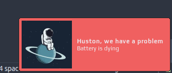

# Batteryarc widget

[](https://github.com/streetturtle/awesome-wm-widgets/labels/batteryarc)

This widget is more informative version of [battery widget](https://github.com/streetturtle/awesome-wm-widgets/tree/master/battery-widget).

Depending of the battery status it could look following ways:

 -  - less than 15 percent
 -  - less than 15 percent, charging
 -  - between 15 and 40 percent
 -  - between 15 and 40 percent, charging
 -  - more than 40 percent
 -  - more than 40 percent, charging

If a battery level is low then warning popup will show up:



## Customization

It is possible to customize widget by providing a table with all or some of the following config parameters:

| Name | Default | Description |
|---|---|---|
| `font` | Play 6 | Font |
| `arc_thickness` | 2 | Thickness of the arc |
| `show_current_level`| false | Show current charge level |
| `size`| 18 | Size of the widget |
| `timeout` | 10 | How often in seconds the widget refreshes |
| `main_color` | `beautiful.fg_color` | Color of the text with the current charge level and the arc |
| `bg_color` | `#ffffff11` | Color of the charge level background |
| `low_level_color` | `#e53935` | Arc color when battery charge is less that 15% |
| `medium_level_color` | `#c0ca33` |  Arc color when battery charge is between 15% and 40% |
| `charging_color` | `#43a047` |  Color of the circle inside the arc when charging  |
| `warning_msg_title` | _Huston, we have a problem_ | Title of the warning popup |
| `warning_msg_text` | _Battery is dying_ | Text of the warning popup |
| `warning_msg_position` | `bottom_right` | Position of the warning popup |
| `warning_msg_icon` | ~/.config/awesome/awesome-wm-widgets/batteryarc-widget/spaceman.jpg | Icon of the warning popup |
| `enable_battery_warning` | `true` | Display low battery warning |
| `show_notification_mode` | `on_hover` | How to trigger a notification with the battery status: `on_hover`, `on_click` or `off`  |
| `notification_position` | `top_left` | Where to show she notification when triggered. Values: `top_right`, `top_left`, `bottom_left`, `bottom_right`, `top_middle`, `bottom_middle`. (default `top_right`) |

## Requirements

This widget requires the `acpi` command to be available to retrieve battery and
power information.

## Installation

Clone repo, include widget and use it in **rc.lua**:

```lua
local batteryarc_widget = require("awesome-wm-widgets.batteryarc-widget.batteryarc")
...
s.mytasklist, -- Middle widget
	{ -- Right widgets
    	layout = wibox.layout.fixed.horizontal,
		...
        --[[default]]
		batteryarc_widget(),		
        --[[or customized]]
        batteryarc_widget({
            show_current_level = true,
            arc_thickness = 1,
        }),
	}
	...
```

## Troubleshooting

In case of any doubts or questions please raise an [issue](https://github.com/streetturtle/awesome-wm-widgets/issues/new).
