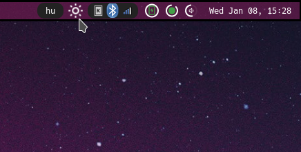
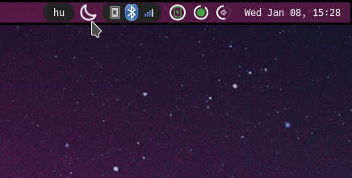
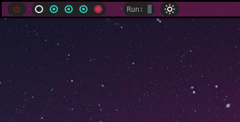

# Blue Light Filter Widget

This widget provides a simple way to toggle a blue light filter using [Redshift](https://github.com/jonls/redshift). It offers an easy mechanism to switch between day and night modes, reducing eye strain during late-night computer use.

| Day Mode | Night Mode |
|----------|------------|
| |  |

(I couldn't capture the effect itself)

I usually use every widget with my custom (kinda janky) [wrapper widget](https://github.com/VMatt013/MySetup/blob/Debian/.config/awesome/widgets/margin.lua) to make them look cleaner and more unified.


**With wrapper**




## Installation

Clone this repository then add the widget to your wibar:

```lua
local bluelight_widget = require("awesome-wm-widgets.bluelight-widget")
local margin = require("awesome-wm-widgets.margin") -- In case you use my wrapper

s.mytasklist, -- Middle widget
    { -- Right widgets
        layout = wibox.layout.fixed.horizontal,
        ...
        bluelight_widget, -- Add the widget here
        margin(bluelight, true), -- Add the widget with my wrapper
        ...
    }
```

## Usage

- Click the widget to toggle between **Day Mode** and **Night Mode**.
  - **Day Mode:** Disables the blue light filter.
  - **Night Mode:** Activates the blue light filter with a warm color temperature.

## Customization

You can customize the widget by modifying the following parameters in the widget's source file:

| Name       | Default                                | Description                                                |
|------------|----------------------------------------|------------------------------------------------------------|
| `ICON_DIR` | ```awesome-wm-widgets/bluelight-widget/```  | Directory where the widget icons (sun.svg and moon.svg) are stored. |
| `CMD`      | ```redshift```                            | Command to run Redshift.                                   |
| `NIGHT_CMD`| ```-O 2500 -g 0.75```                     | Command options for activating Night Mode.                 |
| `DAY_CMD`  | ```-x```                                  | Command options for activating Day Mode.                   |

## Dependencies

- [Redshift](https://github.com/jonls/redshift): Make sure Redshift is installed on your system.
