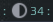

# Brightness widget

This widget represents current brightness level, depending on config parameters could be an arcchart or icon with text: 

## Customization

It is possible to customize widget by providing a table with all or some of the following config parameters:

| Name | Default | Description |
|---|---|---|
| `type`| `arc` | The widget type. Could be `arc` or `icon_and_text` |
| `program` | `light` | The program used to control the brightness, either `light`, `xbacklight`, or `brightnessctl`. |
| `step` | 5 | Step |
| `base` | 20 | Base level to set brightness to on left click. |
| `path_to_icon` | `/usr/share/icons/Arc/status/symbolic/display-brightness-symbolic.svg` | Path to the icon |
| `font` | `beautiful.font` | Font name and size, like `Play 12` |
| `timeout` | 1 | How often in seconds the widget refreshes. Check the note below |
| `tooltip` | false | Display brightness level in a tooltip when the mouse cursor hovers the widget |
| `percentage` | false | Display a '%' character after the brightness level |
| `rmb_set_max` | false | Right mouse click sets the brightness level to maximum |

_Note:_ If brightness is controlled only by the widget (either by a mouse, or by a shortcut, then the `timeout` could be quite big, as there is no reason to synchronize the brightness level).

## Installation

To choose the right `program` argument, first you need to check which of them works better for you. 

 - using `xbacklight`:
 
    Install (on Ubuntu it's available in the apt repository) it and check if it works by running:
 
    ```bash
    xbacklight -get
    ```

    If there is no output it means that it doesn't work, you can either try to fix it, or try to use `light`.

 - using `light` command:
 
    Install (on Ubuntu it's available in the apt repository) from the repo: [github.com/haikarainen/light](https://github.com/haikarainen/light) and check if it works by running

    ```bash
    light -G
    49.18
    light -A 5
    ```
    If you're on Ubuntu/debian and if the brightness level doesn't change, try to do this: https://github.com/haikarainen/light/issues/113#issuecomment-632638436.

  - using `brightnessctl`:

    On Ubuntu it is available in the apt repository. Install and check the ouptut of the following command.
    ```bash
    brightnessctl --list
    ```

Then clone this repo under **~/.config/awesome/**:

```bash
git clone https://github.com/streetturtle/awesome-wm-widgets.git ~/.config/awesome/awesome-wm-widgets
```

Require widget at the beginning of **rc.lua**:

```lua
local brightness_widget = require("awesome-wm-widgets.brightness-widget.brightness")
```

Add the widget to the tasklist:

```lua
s.mytasklist, -- Middle widget
    { -- Right widgets
        layout = wibox.layout.fixed.horizontal,
        ...
        -- default
        brightness_widget(),
        -- or customized
        brightness_widget{
            type = 'icon_and_text',
            program = 'xbacklight',
            step = 2,        
        }
    }
    ...
```

## Controls

In order to change brightness by shortcuts you can add them to the `globalkeys` table in the **rc.lua**:

```lua
awful.key({ modkey         }, ";", function () brightness_widget:inc() end, {description = "increase brightness", group = "custom"}),
awful.key({ modkey, "Shift"}, ";", function () brightness_widget:dec() end, {description = "decrease brightness", group = "custom"}),
```
On a laptop you can use `XF86MonBrightnessUp` and `XF86MonBrightnessDown` keys.
