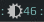

# Brightness widget

This widget represents current brightness level: 

## Customization

It is possible to customize widget by providing a table with all or some of the following config parameters:

| Name | Default | Description |
|---|---|---|
| `get_brightness_cmd` | `light -G` | Get current screen brightness |
| `inc_brightness_cmd` | `light -A 5` | Increase brightness |
| `dec_brightness_cmd` | `light -U 5`| Decrease brightness |
| `color` | `beautiful.fg_color` | Color of the arc |
| `path_to_icon` | `/usr/share/icons/Arc/status/symbolic/display-brightness-symbolic.svg` | Path to the icon |

### Example:

```lua
brightnessarc_widget({
    get_brightness_cmd = 'xbacklight -get',
    inc_brightness_cmd = 'xbacklight -inc 5',
    dec_brightness_cmd = 'xbacklight -dec 5'
    color = '/usr/share/icons/Arc/status/symbolic/brightness-display-symbolic.svg'
})
```


## Installation

First you need to get the current brightness level. There are two options:

 - using `xbacklight` command (depending on your video card (I guess) it may or may not work)
 
    To check if it works install xbackligth and check if it works:
 
    ```bash
    sudo apt-get install xbacklight
    xbacklight -get
    ```

    If there is no output it means that it doesn't work, but there is a second option:

 - using `light` command
 
    Install it from this git repo: [github.com/haikarainen/light](https://github.com/haikarainen/light) and check if it works but running

    ```bash
    git clone https://github.com/haikarainen/light.git && \
    cd ./light && \
    sudo make && sudo make install \
    light -G
    49.18
    ```

Then clone this repo under **~/.config/awesome/**:

```bash
git clone https://github.com/streetturtle/awesome-wm-widgets.git ~/.config/awesome/
```

Require widget at the beginning of **rc.lua**:

```lua
local brightnessarc_widget = require("awesome-wm-widgets.brightnessarc-widget.brightnessarc")
```

Add widget to the tasklist:

```lua
s.mytasklist, -- Middle widget
    { -- Right widgets
        layout = wibox.layout.fixed.horizontal,
        ...
        -- default
        brightnessarc_widget(),
        -- or customized
        brightnessarc_widget({
          get_brightness_cmd = 'xbacklight -get',
          inc_brightness_cmd = 'xbacklight -inc 5',
          dec_brightness_cmd = 'xbacklight -dec 5'
        })      
    }
        ...
```

## Controls

In order to change brightness by shortcuts you can add them to the `globalkeys` table in the **rc.lua**:

```lua
awful.key({ modkey         }, ";", function () awful.spawn("light -A 5") end, {description = "increase brightness", group = "custom"}),
awful.key({ modkey, "Shift"}, ";", function () awful.spawn("light -U 5") end, {description = "decrease brightness", group = "custom"}),
```
On laptop you can use `XF86MonBrightnessUp` and `XF86MonBrightnessDown` keys.
