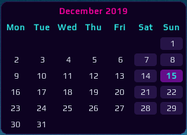
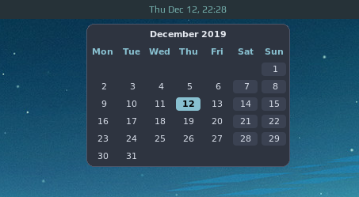
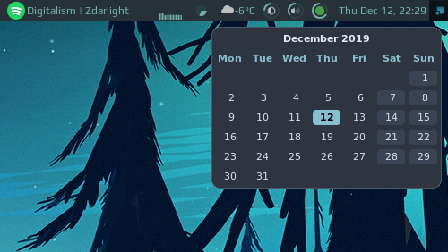
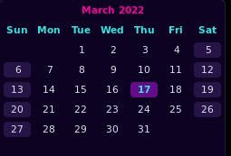

# Calendar Widget

Calendar widget for Awesome WM - slightly improved version of the `wibox.widget.calendar`.

## Features


### Customization

| Name         | Default   | Description                         |
|--------------|-----------|-------------------------------------|
| theme        | `naughty` | The theme to use                    |
| placement    | `top`     | The position of the popup           |
| radius       | 8         | The popup radius                    |
| start_sunday | false     | Start the week on Sunday            |
| week_numbers | false     | Show ISO week numbers (Mon = first) |
| auto_hide    | false     | Auto hide the popup after timeout   |
| timeout      | 2         | Auto hide timeout length         |

 - themes:

    | Name | Screenshot |
    |---|---|
    | nord           |  |
    | outrun         |  |
    | light          |  |
    | dark           |  |
    | naughty (default) | from local theme |

 - setup widget placement

  top center - in case you clock is centered:

   

  top right - for default awesome config:

  

  bottom right - in case your wibar at the bottom:

  

 - setup first day of week

   By setting `start_sunday` to true:
   

 - mouse support:
    move to the next and previous month. Using mouse buttons or scroll wheel.

    You can configure this by specifying the button to move to next/previous.
    Usually these are configured as follows. If you want to use other mouse buttons, you can find their number using `xev`.

    | number | button        |
    |--------|---------------|
    | 4      | scroll up     |
    | 5      | scroll down   |
    | 1      | left click    |
    | 2      | right click   |
    | 3      | middles click |

    By default `previous_month_button` is 5, `next_month_button` is 4.


## How to use

This widget needs an 'anchor' - another widget which triggers visibility of the calendar. Default `mytextclock` is the perfect candidate!
Just after mytextclock is instantiated, create the widget and add the mouse listener to it.

```lua
local calendar_widget = require("awesome-wm-widgets.calendar-widget.calendar")
-- ...
-- Create a textclock widget
mytextclock = wibox.widget.textclock()
-- default
local cw = calendar_widget()
-- or customized
local cw = calendar_widget({
    theme = 'outrun',
    placement = 'bottom_right',
    start_sunday = true,
    radius = 8,
-- with customized next/previous (see table above)
    previous_month_button = 1,
    next_month_button = 3,
})
mytextclock:connect_signal("button::press",
    function(_, _, _, button)
        if button == 1 then cw.toggle() end
    end)
```
