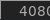
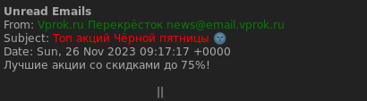

# Email widget

This widget consists of an icon with counter which shows number of unread emails: 
and a popup message which appears when mouse hovers over an icon: 

Note that widget uses the Arc icon theme, so it should be [installed](https://github.com/horst3180/arc-icon-theme#installation) first under **/usr/share/icons/Arc/** folder.

## Installation

To install it put **email.lua** and **email-widget** folder under **~/.config/awesome**. Then 

 - in **email.lua** change path to python scripts;
 - in python scripts add your credentials (note that password should be encrypted using pgp for example);
 - add widget to awesome:

```lua
local email_widget, email_icon = require("email")

...
s.mytasklist, -- Middle widget
	{ -- Right widgets
    	layout = wibox.layout.fixed.horizontal,
		...
		email_icon,
        email_widget,
		...      
```

## How it works

This widget uses the output of two python scripts, first is called every 20 seconds - it returns number of unread emails and second is called when mouse hovers over an icon and displays content of those emails. For both of them you'll need to provide your credentials and imap server. For testing, they can simply be called from console:

``` bash
python ~/.config/awesome/email/count_unread_emails.py 
python ~/.config/awesome/email/read_emails.py 
```
