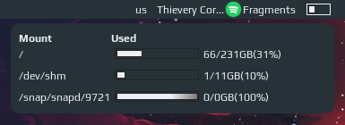

# Filesystem Widget

This widget shows file system disk space usage which is based on the `df` output. When clicked another widget appears with more detailed information. By default it monitors the "/" mount. It can be configured with a list of mounts to monitor though only the first will show in the wibar. To have multiple mounts displayed on the wibar simply define multiple `fs_widgets` with different mounts as arguments.



## Customizations

It is possible to customize widget by providing a table with all or some of the following config parameters:

| Name | Default | Description |
|---|---|---|
| `mounts` | `{'/'}` | Table with mounts to monitor, check the output from a `df` command for available options (column 'Mounted on') |
| `timeout` | 60 | How often in seconds the widget refreshes |

## Installation

Clone/download repo and use the widget in **rc.lua**:

```lua
  local fs_widget = require("awesome-wm-widgets.fs-widget.fs-widget")
  ...
  s.mywibox:setup {
      s.mytasklist, -- Middle widget
      { -- Right widgets
      fs_widget(), --default
      fs_widget({ mounts = { '/', '/mnt/music' } }), -- multiple mounts
  ...
```
