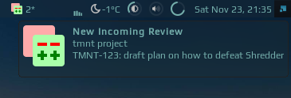

# Gerrit widget

It shows number of currently assigned reviews in [Gerrit](https://www.gerritcodereview.com/) to the user (by default) :
 
 
 
 when clicked it shows reviews in a list:
 
 
 
 left click on an item will open review in the default browser, right click will copy the review number, which you can use to checkout this review by running `git-review -d <review number>`.
 
 Also, if a new review is assigned to the user, there will be a pop-up:
 
 

## Customization

It is possible to customize widget by providing a table with all or some of the following config parameters:

| Name | Default | Description |
|---|---|---|
| `icon`| `/.config/awesome/awesome-wm-widgets/gerrit-widget/gerrit_icon.svg`| Path to the icon |
| `host` | Required | Ex https://gerrit.tmnt.com |
| `query` | `is:reviewer AND status:open AND NOT is:wip` | Query to retrieve reviews |
| `timeout` | 10 | How often in seconds the widget refreshes |

## Prerequisite

 - [curl](https://curl.haxx.se/) - is used to communicate with gerrit's [REST API](https://gerrit-review.googlesource.com/Documentation/rest-api.html)
 - setup [netrc](https://ec.haxx.se/usingcurl-netrc.html) which is used to store username and password in order to call API's endpoints.

## Installation

1. This widget relies on Gerrit [REST API](https://gerrit-review.googlesource.com/Documentation/rest-api.html), so you need to have a permission to access it. You also need to setup [netrc](https://ec.haxx.se/usingcurl-netrc.html), as widget uses curl to communicate with API and you have to be authenticated. 
To test if you have access to API and netrc setup is correct run following command, you should have a json response:

    ```bash
     curl  -s --request GET --netrc https://gerrit-host.com/a/changes/\?q\=status:open+AND+NOT+is:wip+AND+is:reviewer | tail -n +2
    ``` 
    Note: `tail -n +2` is needed to skip first line of the response, as gerrit returns some characters there in order to prevent XSS hacks.

1. Download json parser for lua from [github.com/rxi/json.lua](https://github.com/rxi/json.lua) and place it under **~/.config/awesome/** (don't forget to star a repo):

    ```bash
    wget -P ~/.config/awesome/ https://raw.githubusercontent.com/rxi/json.lua/master/json.lua
    ```

1. Clone this repo (if not cloned yet) under **~/.config/awesome/**:

    ```bash
    git clone https://github.com/streetturtle/awesome-wm-widgets.git ~/.config/awesome/
    ```

1. Require widget at the top of the **rc.lua**:

    ```lua
    local gerrit_widget = require("awesome-wm-widgets.gerrit-widget.gerrit")
    ```

1. Add widget to the tasklist:

    ```lua
    s.mytasklist, -- Middle widget
        { -- Right widgets
            layout = wibox.layout.fixed.horizontal,
            ...
            --default
            gerrit_widget({host = 'https://gerrit.tmnt.com'}),
            --customized
            gerrit_widget({
                host = 'https://gerrit.tmnt.com',
                query = 'is:reviewer AND is:wip'
            })
            ...
    ```
    
