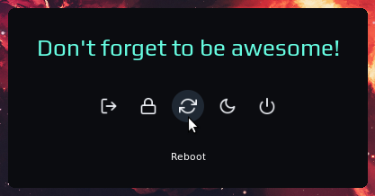

# Logout widget

Widget which allows to perform lock, reboot, log out, power off and sleep actions. It can be called either by a shortcut, or by clicking on a widget in wibar.

<p align="center">
    
</p>

# Installation

Clone this (if not cloned yet) and the [awesome-buttons](https://github.com/streetturtle/awesome-buttons) repos under **./.config/awesome/**

```bash
cd ./.config/awesome/
git clone https://github.com/streetturtle/awesome-wm-widgets
git clone https://github.com/streetturtle/awesome-buttons
```
Then 

- to show by a shortcut - define a shortcut in `globalkeys`:

    ```lua
    local logout = require("awesome-wm-widgets.experiments.logout-widget.logout")
    ...
    globalkeys = gears.table.join(
    ...
        awful.key({ modkey }, "l", function() logout.launch() end, {description = "Show logout screen", group = "custom"}),
    ```

- to show by clicking on a widget in wibar - add widget to the wibar:

    ```lua
    local logout = require("awesome-wm-widgets.experiments.logout-widget.logout")
    
    s.mytasklist, -- Middle widget
            { -- Right widgets
                layout = wibox.layout.fixed.horizontal,
                ...
                logout.widget{},
                ...
    ```

# Customisation

| Name | Default | Description |
|---|---|---|
| `icon` | `power.svg` | If used as widget - the path to the widget's icon |
| `bg_color` |  `beautiful.bg_normal` | The color the background of the |
| `accent_color` | `beautiful.bg_focus` | The color of the buttons |
| `text_color` | `beautiful.fg_normal` | The color of text |
| `phrases` | `{'Goodbye!'}` | The table with phrase(s) to show, if more than one provided, the phrase is chosen randomly |
| `onlogout` | `function() awesome.quit() end` | Function which is called when the logout button is pressed |
| `onlock` | `function() awful.spawn.with_shell("systemctl suspend") end` | Function which is called when the lock button is pressed |
| `onreboot` | `function() awful.spawn.with_shell("reboot") end` | Function which is called when the reboot button is pressed |
| `onsuspend` | `function() awful.spawn.with_shell("systemctl suspend") end` | Function which is called when the suspend button is pressed |
| `onpoweroff` | `function() awful.spawn.with_shell("shutdown now") end` | Function which is called when the poweroff button is pressed |

Some color themes for inspiration:




```lua
logout.launch{
    bg_color = "#261447", accent_color = "#ff4365", text_color = '#f706cf', -- outrun
    -- bg_color = "#0b0c10", accent_color = "#1f2833", text_color = '#66fce1', -- dark
    -- bg_color = "#3B4252", accent_color = "#88C0D0", text_color = '#D8DEE9', -- nord
    phrases = {"exit(0)", "Don't forget to be awesome.", "Yippee ki yay!"},
}
```
