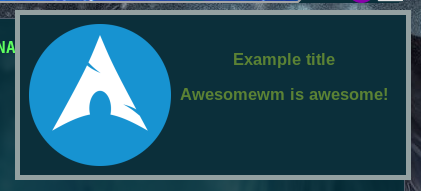

# Important #
This works only for the `awesome-git` Version otherwise an error would appear!

# Screenshot #


# Requirements #
- Font: *Liberation*

# How to use it #
Just add this line to your `rc.lua`:
```lua
require("awesome-wm-widgets.notification-widgets.version1.notify")
```
and it should work than out of the box.
