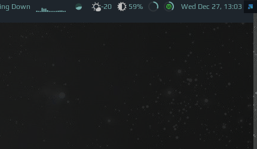

# Ram widget

This widget shows the RAM usage. When clicked another widget appears with more detailed information:



Note: this widget is compatible with Awesome v4.3+, as it is using [awful.popup](https://awesomewm.org/doc/api/classes/awful.popup.html)

## Customization

It is possible to customize widget by providing a table with all or some of the following config parameters:

| Name | Default | Description |
|---|---|---|
| `color_used` | `beautiful.bg_urgent` | Color for used RAM |
| `color_free` | `beautiful.fg_normal` | Color for free RAM |
| `color_buf`  | `beautiful.border_color_active` | Color for buffers/cache |
| `widget_height` | 25 | Height of the widget |
| `widget_width` | 25 | Width of the widget |
| `widget_show_buf`  | false | Whether to display buffers/cache separately in the tray widget. If `false`, buffers/cache are considered free RAM. |
| `timeout`    | 1 | How often in seconds the widget refreshes |

## Installation

Please refer to the [installation](https://github.com/streetturtle/awesome-wm-widgets#installation) section of the repo.

Clone repo, include widget and use it in **rc.lua**:

```lua
local ram_widget = require("awesome-wm-widgets.ram-widget.ram-widget")
...
s.mytasklist, -- Middle widget
	{ -- Right widgets
    	layout = wibox.layout.fixed.horizontal,
		...
		ram_widget(),
    		...
	}
	...
```

