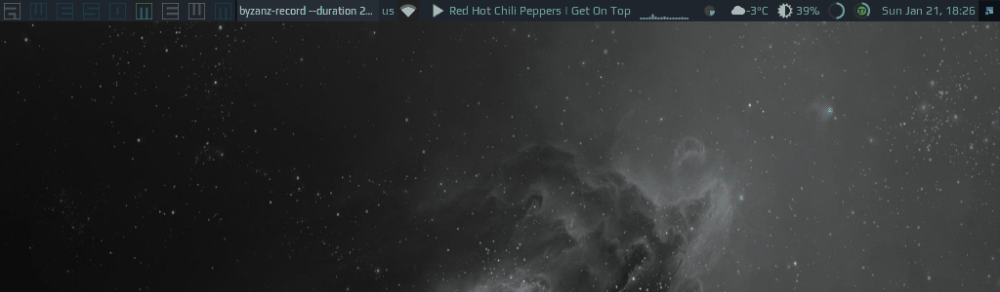

# Spotify Shell




## Features

1. Supports following commands (same as `sp` client):
    - `play`/`pause`/`next`;
    - any other string will start a search and play the first result for a given search query;
    - feh - shows the current artwork with `feh`;

1. Stores history and allows navigating through it;

1. Highly customizable

## Controls

Keyboard navigation (copied from [`awful.prompt`](https://awesomewm.org/doc/api/libraries/awful.prompt.html) API documentation page):

| Name | Usage |
|---|---|
| CTRL+A | beginning-of-line |
| CTRL+B | backward-char |
| CTRL+C | cancel |
| CTRL+D | delete-char |
| CTRL+E | end-of-line |
| CTRL+J | accept-line |
| CTRL+M | accept-line |
| CTRL+F | move-cursor-right |
| CTRL+H | backward-delete-char |
| CTRL+K | kill-line |
| CTRL+U | unix-line-discard |
| CTRL+W | unix-word-rubout |
| CTRL+BACKSPACE | unix-word-rubout |
| SHIFT+INSERT | paste |
| HOME | beginning-of-line |
| END | end-of-line |
| CTRL+R | reverse history search, matches any history entry containing search term. |
| CTRL+S | forward history search, matches any history entry containing search term. |
| CTRL+UP | ZSH up line or search, matches any history entry starting with search term. |
| CTRL+DOWN | ZSH down line or search, matches any history entry starting with search term. |
| CTRL+DELETE | delete the currently visible history entry from history file. This does not delete new commands or history entries under user editing. |


## Installation

1. Install [sp](https://gist.github.com/streetturtle/fa6258f3ff7b17747ee3) - CLI client for [Spotify for Linux](https://www.spotify.com/ca-en/download/linux/):

    ```bash
    $ sudo git clone https://gist.github.com/fa6258f3ff7b17747ee3.git ~/dev/
    $ sudo ln -s ~/dev/sp /usr/local/bin/
    ```

    Check if it works by running `sp help`.

1. Get an 'id' and 'secret' from [developer.spotify.com](https://beta.developer.spotify.com/documentation/general/guides/app-settings/) and paste it in the header of the `sp` (`SP_ID` and `SP_SECRET`) - this enables search feature.

1. Clone this repo under **~/.config/awesome/**

1. Require spotify-shell at the beginning of **rc.lua**:

    ```lua
    local spotify_shell = require("awesome-wm-widgets.spotify-shell.spotify-shell")
    ```

1. Add a shortcut which will show Spotify Shell widget:

    ```lua
    awful.key({ modkey,        }, "d", function () spotify_shell.launch() end, {description = "spotify shell", group = "music"}),
    ```

1. It uses icon from [Papirus Icon Theme](https://github.com/PapirusDevelopmentTeam/papirus-icon-theme). So you should either install this icon theme, or download an icon you want to use and provide path to it in **spotify-shell.lua**.
