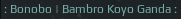

# Spotify widget

This widget displays currently playing song on [Spotify for Linux](https://www.spotify.com/download/linux/) client: 

Some features:

 - status icon which shows if music is currently playing
 - artist and name of the current song
 - dim widget if spotify is paused
 - trim long artist/song names
 - tooltip with more info about the song

## Controls

 - left click - play/pause
 - scroll up - play next song
 - scroll down - play previous song

## Dependencies

Note that widget uses the Arc icon theme, so it should be [installed](https://github.com/horst3180/arc-icon-theme#installation) first under **/usr/share/icons/Arc/** folder.

## Customization

It is possible to customize widget by providing a table with all or some of the following config parameters:

| Name | Default | Description |
|---|---|---|
| `play_icon` | `/usr/share/icons/Arc/actions/24/player_play.png` | Play icon |
| `pause_icon` | `/usr/share/icons/Arc/actions/24/player_pause.png` | Pause icon |
| `font` | `Play 9`| Font |
| `dim_when_paused` | `false` | Decrease the widget opacity if spotify is paused |
| `dim_opacity` | `0.2` | Widget's opacity when dimmed, `dim_when_paused` should be set to `true` |
| `max_length` | `15` | Maximum lentgh of artist and title names. Text will be ellipsized if longer. |
| `show_tooltip` | `true` | Show tooltip on hover with information about the playing song |
| `timeout` | 1 | How often in seconds the widget refreshes |


### Example:

```lua
spotify_widget({
    font = 'Ubuntu Mono 9',
    play_icon = '/usr/share/icons/Papirus-Light/24x24/categories/spotify.svg',
    pause_icon = '/usr/share/icons/Papirus-Dark/24x24/panel/spotify-indicator.svg',
    dim_when_paused = true,
    dim_opacity = 0.5,
    max_length = -1,
    show_tooltip = false
})
```

Gives following widget

Playing:


Paused:


## Installation

First you need to have spotify CLI installed, it uses dbus to communicate with spotify-client:

```bash 
git clone https://gist.github.com/fa6258f3ff7b17747ee3.git
cd ./fa6258f3ff7b17747ee3 
chmod +x sp
sudo cp ./sp /usr/local/bin/
```

Then clone repo under **~/.config/awesome/** and add widget in **rc.lua**:

```lua
local spotify_widget = require("awesome-wm-widgets.spotify-widget.spotify")
...
s.mytasklist, -- Middle widget
	{ -- Right widgets
    	layout = wibox.layout.fixed.horizontal,
		...
        -- default        
        spotify_widget(),
        -- customized
        spotify_widget({
           font = 'Ubuntu Mono 9',
           play_icon = '/usr/share/icons/Papirus-Light/24x24/categories/spotify.svg',
           pause_icon = '/usr/share/icons/Papirus-Dark/24x24/panel/spotify-indicator.svg'
        }),
		...      
```
