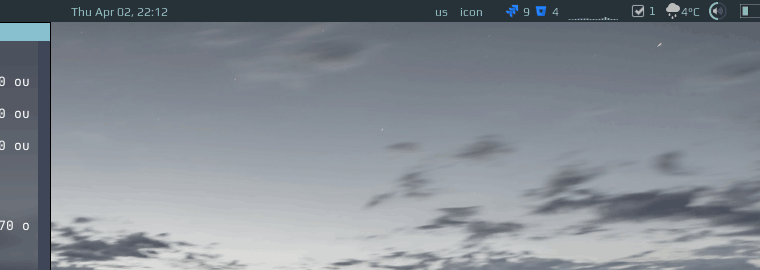

# ToDo Widget (in progress)

This widget displays a list of to do items and allows to mark item as done/undone, delete an item and create a new ones:



# Installation

Put a **json.lua** from this repository: https://github.com/rxi/json.lua under ~/.config/awesone folder. And don't forget to start a repo :)

Then clone this repo under **~/.config/awesome/** and add the widget in **rc.lua**:

```lua
local todo_widget = require("awesome-wm-widgets.todo-widget.todo")
...
s.mytasklist, -- Middle widget
	{ -- Right widgets
    	layout = wibox.layout.fixed.horizontal,
		...
        -- default        
        todo_widget(),
		...      
```
