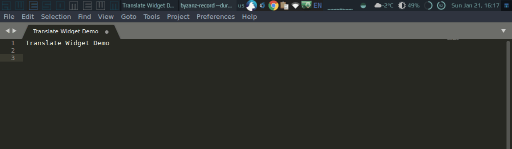

# Translate Widget

This widget allows quickly translate words or phrases without opening a browser - just using Awesome. To provide direction of the translation add the 2 letters code of the source and target languages at the end of the phrase, for example _hello enfr_ will translate _hello_ from English to French. This widget is based on [Watson Language Translator](https://www.ibm.com/watson/services/language-translator/) from IBM.



## Controls

 - <kbd>Mod4</kbd> + <kbd>c</kbd> - opens a translate prompt;
 - left click on the popup widget - copies the translation to the clipboard and closes widget;
 - right click on the popup widget - copies text to translate to the clipboard and closes widget.

## Installation

1. Clone repo under **~/.config/awesome/**
1. Create an IBM Cloud API key at [cloud.ibm.com/iam/apikeys](https://cloud.ibm.com/iam/apikeys)
1. Copy a service URL by going to [resource list](https://cloud.ibm.com/resources), then under "Services" select "Language Translator" option, and then copy URL from the "Credentials" section
1. Require widget in **rc.lua**:

    ```lua
    local translate = require("awesome-wm-widgets.translate-widget.translate")
    ```

1. Add a shortcut to run translate prompt:

    ```lua
    awful.key({ modkey }, "c", function() 
        translate.launch{api_key = '<api-key>', url = 'url'} 
   end, { description = "run translate prompt", group = "launcher" })    
   ```
   
   
   
      
   
   
   

