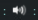

# Volume widget

Simple and easy-to-install widget for Awesome Window Manager which shows the sound level: 

Note that widget uses the Arc icon theme, so it should be [installed](https://github.com/horst3180/arc-icon-theme#installation) first under **/usr/share/icons/Arc/** folder.

## Customization

It is possible to customize widget by providing a table with all or some of the following config parameters:

| Name | Default | Description |
|---|---|---|
| `volume_audio_controller` | `pulse` | audio device |
| `notification` | `false` | Display a notification on mouseover |
| `notification_position` | `top_right` | The notification position |

## Installation

- clone/copy **volume.lua** file;

- include `volume.lua` and add volume widget to your wibox in rc.lua:

```lua
require("volume")
...
s.mytasklist, -- Middle widget
	{ -- Right widgets
    	layout = wibox.layout.fixed.horizontal,
		...
		volume_widget(),
		...
```

- _Optional step._ In Arc icon theme the muted audio level icon () looks like 0 level icon, which could be a bit misleading.
 So I decided to use original muted icon for low audio level, and the same icon, but colored in red for muted audio level. Fortunately icons are in svg format, so you can easily recolor them with `sed`, so it would look like this ():

 ```bash
 cd /usr/share/icons/Arc/status/symbolic &&
 sudo cp audio-volume-muted-symbolic.svg audio-volume-muted-symbolic_red.svg &&
 sudo sed -i 's/bebebe/ed4737/g' ./audio-volume-muted-symbolic_red.svg
 ```

### Pulse or ALSA only

Try running this command:

```bash
amixer -D pulse sget Master
```

If that prints something like this, then the default setting of 'pulse' is probably fine:

```
Simple mixer control 'Master',0
  Capabilities: pvolume pvolume-joined pswitch pswitch-joined
  Playback channels: Mono
  Limits: Playback 0 - 64
  Mono: Playback 64 [100%] [0.00dB] [on]

```

If it prints something like this:

```bash
$ amixer -D pulse sget Master
ALSA lib pulse.c:243:(pulse_connect) PulseAudio: Unable to connect: Connection refused

amixer: Mixer attach pulse error: Connection refused
```
then set `volume_audio_controller` to `alsa_only` in widget constructor:

```lua
volume_widget({
    volume_audio_controller = 'alsa_only'
})
```

.

## Control volume

To mute/unmute click on the widget. To increase/decrease volume scroll up or down when mouse cursor is over the widget.

If you want to control volume level by keyboard shortcuts add following lines in shortcut section of the **rc.lua** (the commands could be slightly different depending on your PC configuration):

```lua
awful.key({ modkey}, "[", function () awful.spawn("amixer -D pulse sset Master 5%+") end, {description = "increase volume", group = "custom"}),
awful.key({ modkey}, "]", function () awful.spawn("amixer -D pulse sset Master 5%-") end, {description = "decrease volume", group = "custom"}),
awful.key({ modkey}, "\", function () awful.spawn("amixer -D pulse set Master +1 toggle") end, {description = "mute volume", group = "custom"}),
```
