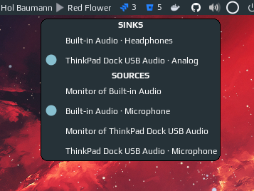

# Volume widget

Volume widget based on [amixer](https://linux.die.net/man/1/amixer) (is used for controlling the audio volume) and [pacmd](https://linux.die.net/man/1/pacmd) (is used for selecting a sink/source). Also, the widget provides an easy way to customize how it looks, following types are supported out-of-the-box:


From left to right: `horizontal_bar`, `vertical_bar`, `icon`, `icon_and_text`, `arc`

A right-click on the widget opens a popup where you can choose a sink/source:  


Left click toggles mute and middle click opens a mixer ([pavucontrol](https://freedesktop.org/software/pulseaudio/pavucontrol/) by default).

### Features

 - switch between sinks/sources by right click on the widget;
 - more responsive than previous versions of volume widget, which were refreshed once a second;
 - 5 predefined customizable looks;

## Installation

Clone the repo under **~/.config/awesome/** and add widget in **rc.lua**:

```lua
local volume_widget = require('awesome-wm-widgets.volume-widget.volume')
...
s.mytasklist, -- Middle widget
	{ -- Right widgets
    	layout = wibox.layout.fixed.horizontal,
        ...
        -- default
        volume_widget(),
        -- customized
        volume_widget{
            widget_type = 'arc'
        },
```

Note that the widget uses following command to get the current volume: `amixer -c 1 -D pulse sget Master`, so please make sure that it works for you, otherwise you need to set some parameters by entering this command in the terminal:

Command output:
- Some data of a mixer: Override all parameters you've changed
- Error `Invalid card number`: Change parameter `-c`/ `card`
- Error `Mixer attach pulse error: No such file or directory`: Change parameter `-D`/ `device`
- Error `Unable to find simple control 'Master',0`: Change parameter `mixctrl`

Note: `amixer[ -c ...][ -D ...]` returns a list of Mixers for the selected card/ device. omitting `-D` falls back to `default`.

### Shortcuts

To improve responsiveness of the widget when volume level is changed by a shortcut use corresponding methods of the widget:

```lua
awful.key({ modkey }, "]", function() volume_widget:inc(5) end),
awful.key({ modkey }, "[", function() volume_widget:dec(5) end),
awful.key({ modkey }, "\\", function() volume_widget:toggle() end),
```

You also can use Functional keycodes instead of symbols, e.g. `XF86AudioRaiseVolume` instead of `"]"`.

```lua
awful.key({}, "XF86AudioRaiseVolume", function() volume_widget.inc() end),
awful.key({}, "XF86AudioLowerVolume", function() volume_widget.dec() end),
awful.key({}, "XF86AudioMute", function() volume_widget.toggle() end),
```
If you don't know the name of the key, you can use `xev` to find it out.
Or you can use `amixer` and `playerctl` to control the volume and media players.

```lua
awful.key({}, "XF86AudioLowerVolume", function ()
    awful.util.spawn("amixer -q -D pulse sset Master 5%-", false) end),
awful.key({}, "XF86AudioRaiseVolume", function ()
    awful.util.spawn("amixer -q -D pulse sset Master 5%+", false) end),
awful.key({}, "XF86AudioMute", function ()
    awful.util.spawn("amixer -D pulse set Master 1+ toggle", false) end),
-- Media Keys
awful.key({}, "XF86AudioPlay", function()
    awful.util.spawn("playerctl play-pause", false) end),
awful.key({}, "XF86AudioNext", function()
    awful.util.spawn("playerctl next", false) end),
awful.key({}, "XF86AudioPrev", function()
    awful.util.spawn("playerctl previous", false) end),
```

## Customization

It is possible to customize the widget by providing a table with all or some of the following config parameters:

### Generic parameter

| Name          | Default         | Description                                                                                                                           |
|---------------|-----------------|---------------------------------------------------------------------------------------------------------------------------------------|
| `mixer_cmd`   | `pavucontrol`   | command to run on middle click (e.g. a mixer program)                                                                                 |
| `toggle_cmd`  | *nil*           | Use custom command instead of `amixer ... toggle` because [amixer's unmute option seems to be broken](https://superuser.com/a/822085) |
| `step`        | 5               | How much the volume is raised or lowered at once (in %)                                                                               |
| `widget_type` | `icon_and_text` | Widget type, one of `horizontal_bar`, `vertical_bar`, `icon`, `icon_and_text`, `arc`                                                  |
| `card`        | 0               | Select the card name to control                                                                                                       |
| `device`      | `pulse`         | Select the device name to control                                                                                                     |
| `mixctrl`     | `Master`        | Select the mixer name to control                                                                                                      |
| `value_type`  | `-M`            | Select how the volume is increased/ decreased (intended for `-M`/ `-R` parameters). See `man amixer` for additional info              |

Note: If unmuting or toggling using the default amixer command does not work, this command may work: `pactl set-sink-mute [card] toggle`

Depends on the chosen widget type add parameters from the corresponding section below:

#### `icon` parameters

| Name       | Default              | Description                                   |
|------------|----------------------|-----------------------------------------------|
| `icon_dir` | `[widget_dir]/icons` | Path to the folder with icons (absolute path) |

_Note:_ if you are changing icons, the folder should contain following .svg images: 
 - audio-volume-high-symbolic
 - audio-volume-medium-symbolic
 - audio-volume-low-symbolic
 - audio-volume-muted-symbolic

#### `icon_and_text` parameters

| Name       | Default              | Description                                   |
|------------|----------------------|-----------------------------------------------|
| `icon_dir` | `[widget_dir]/icons` | Path to the folder with icons (absolute path) | 
| `font`     | `beautiful.font`     | Font name and size, like `Play 12`            |

#### `arc` parameters

| Name | Default | Description |
|---|---|---|
| `thickness` | 2 | Thickness of the arc |
| `main_color` | `beautiful.fg_color` | Color of the arc |
| `bg_color` | `#ffffff11` | Color of the arc's background |
| `mute_color` | `beautiful.fg_urgent` | Color of the arc when mute |
| `size` | 18 | Size of the widget |

#### `horizontal_bar` parameters

| Name | Default | Description |
|---|---|---|
| `main_color` | `beautiful.fg_normal` | Color of the bar |
| `mute_color` | `beautiful.fg_urgent` | Color of the bar when mute |
| `bg_color` | `#ffffff11` | Color of the bar's background |
| `width` | 50 | The bar width |
| `margins` | 10 | Top and bottom margins (if your wibar is 22 px high, bar will be 2 px = 22 - 2*10) |
| `shape` | `bar` | [gears.shape](https://awesomewm.org/doc/api/libraries/gears.shape.html), could be `octogon`, `hexagon`, `powerline`, etc |
| `with_icon` | true | Show volume icon|

_Note:_ I didn't figure out how does the `forced_height` property of progressbar widget work (maybe it doesn't work at all), thus there is a workaround with margins.

#### `vertical_bar` parameters

| Name | Default | Description |
|---|---|---|
| `main_color` | `beautiful.fg_normal` | Color of the bar |
| `mute_color` | `beautiful.fg_urgent` | Color of the bar when mute |
| `bg_color` | `#ffffff11` | Color of the bar's background |
| `width` | 10 | The bar width |
| `margins` | 20 | Top and bottom margins (if your wibar is 22 px high, bar will be 2 px = 22 - 2*10) |
| `shape` | `bar` | [gears.shape](https://awesomewm.org/doc/api/libraries/gears.shape.html), could be `octogon`, `hexagon`, `powerline`, etc |
| `with_icon` | true | Show volume icon| 
