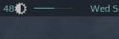

# Volumebar widget

Almost the same as volume widget, but more minimalistic:



Supports 
 - scroll up - increase volume, 
 - scroll down - decrease volume, 
 - left click - mute/unmute.
 
## Customization
 
It is possible to customize widget by providing a table with all or some of the following config parameters:

| Name | Default | Description |
|---|---|---|
| `main_color` | `beautiful.fg_normal` | Color of the bar |
| `mute_color` | `beautiful.fg_urgent` | Color of the bar when mute |
| `width` | 50 | The bar width |
| `shape` | `bar` | [gears.shape](https://awesomewm.org/doc/api/libraries/gears.shape.html), could be `octogon`, `hexagon`, `powerline`, etc |
| `margin` | `10` | Top and bottom margin (if your wibar is 22 px high, bar will be 2 px (22 - 2*10)) |
| `get_volume_cmd` | `amixer -D pulse sget Master` | Get current volume level |
| `inc_volume_cmd` | `amixer -D pulse sset Master 5%+` | Increase volume level |
| `dec_volume_cmd` | `amixer -D pulse sset Master 5%-` | Decrease volume level |
| `tog_volume_cmd` | `amixer -D pulse sset Master toggle` | Mute / unmute |

### Example:

 ```lua
 volumebar_widget({
    main_color = '#af13f7',
    mute_color = '#ff0000',
    width = 80,
    shape = 'rounded_bar',
    margins = 8
})
 ```

Above config results in following widget:

 


## Installation
 
1. Clone this repo under **~/.config/awesome/**

    ```bash
    git clone https://github.com/streetturtle/awesome-wm-widgets.git ~/.config/awesome/
    ```

1. Require volumebar widget at the beginning of **rc.lua**:

    ```lua
    local volumebar_widget = require("awesome-wm-widgets.volumebar-widget.volumebar")
    ```

1. Add widget to the tasklist:

    ```lua
    s.mytasklist, -- Middle widget
        { -- Right widgets
            layout = wibox.layout.fixed.horizontal,
            ...
            --[[default]]
            volumebar_widget(),
            --[[or customized]]
            volumebar_widget({
                main_color = '#af13f7',
                mute_color = '#ff0000',
                width = 80,
                shape = 'rounded_bar', -- octogon, hexagon, powerline, etc
                -- bar's height = wibar's height minus 2x margins
                margins = 8
            }),

            ...
    ```

## Troubleshooting

If the bar is not showing up, try to decrease top or bottom margin - widget uses hardcoded margins for vertical alignment, so if your wibox is too small then bar is simply hidden by the margins.
