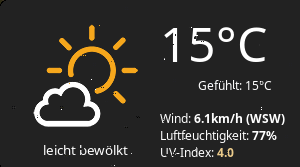

# WeatherAPI widget



The widget consists of one section:
- current weather, including humidity, wind speed, UV index

## Customization

It is possible to customize widget by providing a table with all or some of the
following config parameters:

| Name | Default | Description |
|---|---|---|
| coordinates | Required | Table with two elements: latitude and longitude, e.g. `{46.204400, 6.143200}` | 
| api_key | Required | [Follow the documentation](https://www.weatherapi.com/docs/) |
| font_name | `beautiful.font:gsub("%s%d+$", "")` | **Name** of the font to use e.g. 'Play' |
| units | `metric` | `metric` for celsius, `imperial` for fahrenheit |
| icon_pack_name | `weather-underground-icons` | Name of the icon pack, could be `weather-underground-icon` or `VitalyGorbachev` or create your own, more details below |
| icons_extension | `.png` | File extension of icons in the pack |
| timeout | 120 | How often in seconds the widget refreshes |

### Icons:

The widget comes with two predefined icon packs:

 - [weather-underground-icons](https://github.com/manifestinteractive/weather-underground-icons)
 - [VitalyGorbachev](https://www.flaticon.com/authors/vitaly-gorbachev)

To add your custom icons, create a folder with the pack name under `/icons` and
use the folder name in widget's config. There should be 18 icons, preferably
128x128 minimum. Icons should also respect the naming convention, please check
widget's source.

### Examples

#### Custom font, icons

```lua
weather_api_widget({
    api_key='<your-key>',
    coordinates = {45.5017, -73.5673},
    units = 'imperial',
    font_name = 'Carter One',
    icons = 'VitalyGorbachev',
    icons_extension = '.svg',
}),
```

#### Only current weather

```lua
weather_api_widget({
    api_key='<your-key>',
    coordinates = {45.5017, -73.5673},
}),
```

## Installation

1. Download json parser for lua from
   [github.com/rxi/json.lua](https://github.com/rxi/json.lua) and place it
   under **~/.config/awesome/**
   (don't forget to star a repo <i class="fa fa-github-alt"></i> ):

    ```bash
    wget -P ~/.config/awesome/ https://raw.githubusercontent.com/rxi/json.lua/master/json.lua
    ```

1. Clone this repo under **~/.config/awesome/**:

    ```bash
    git clone https://github.com/streetturtle/awesome-wm-widgets.git ~/.config/awesome/
    ```

1. [Get Weather API key](https://www.weatherapi.com/docs/).

1. Require weather widget at the beginning of **rc.lua**:

    ```lua
    local weather_api_widget = require("awesome-wm-widgets.weather-api-widget.weather")
    ```

1. Add widget to the tasklist:

    ```lua
    s.mytasklist, -- Middle widget
        { -- Right widgets
            layout = wibox.layout.fixed.horizontal,
            ...
            --default
            weather_api_widget({
                api_key='<your-key>',
                coordinates = {45.5017, -73.5673},
            }),
            ,
            --customized
            weather_api_widget({
                api_key='<your-key>',
                coordinates = {45.5017, -73.5673},
                units = 'imperial',
                font_name = 'Carter One',
                icons = 'VitalyGorbachev',
                icons_extension = '.svg',
            }),
            ...
    ```

## How it works

The widget calls the API repeatedly in the specified intervals. The JSON
response is parsed and interpreted to build the popup.
