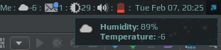

# Weather widget



Note that widget uses the Arc icon theme, so it should be [installed](https://github.com/horst3180/arc-icon-theme#installation) first under **/usr/share/icons/Arc/** folder.

## Customization

It is possible to customize widget by providing a table with all or some of the following config parameters:

| Name | Default | Description |
|---|---|---|
| `font` | `Play 9` | Font |
| `city` | `Montreal,ca` | City name and country code, [more info](https://openweathermap.org/current) |
| `api_key` | none| API key, required |
| `units` | `metric` | `metric` for celsius, `imperial` for fahrenheit |
| `both_units_widget` | `false` | show temperature in both units (15°C (59°F)) or in one (15°C) |
| `both_units_popup` | `false` | same as above but for popup |
| `notification_position` | `top_right` | The notification position |


### Example:

```lua
weather_widget({
    api_key = 'your-api-key',
    units = 'imperial',
    font = 'Ubuntu Mono 9'
}),
```


## Installation

1. Install lua socket - to make HTTP calls to get the weather information.

    ```bash
    $ sudo apt-get install lua-socket
    ```

1. Download json parser for lua from [github.com/rxi/json.lua](https://github.com/rxi/json.lua) and place it under **~/.config/awesome/** (don't forget to star a repo <i class="fa fa-github-alt"></i> ):

    ```bash
    wget -P ~/.config/awesome/ https://raw.githubusercontent.com/rxi/json.lua/master/json.lua
    ```

1. Clone this repo under **~/.config/awesome/**:

    ```bash
    git clone https://github.com/streetturtle/awesome-wm-widgets.git ~/.config/awesome/
    ```

1.  Get Open Weather Map app id here: [openweathermap.org/appid](https://openweathermap.org/appid).

1. Require weather widget at the beginning of **rc.lua**:

    ```lua
    local weather_widget = require("awesome-wm-widgets.weather-widget.weather")
    ```

1. Add widget to the tasklist:

    ```lua
    s.mytasklist, -- Middle widget
        { -- Right widgets
            layout = wibox.layout.fixed.horizontal,
            ...
            --default
            weather_widget({api_key = 'your-api-key'}),
            --customized
            weather_widget({
                api_key = 'your-api-key',
                units = 'imperial',
                font = 'Ubuntu Mono 9'
            })
            ...
    ```


You can read how it works in more details [here](http://pavelmakhov.com/2017/02/weather-widget-for-awesome-wm)
