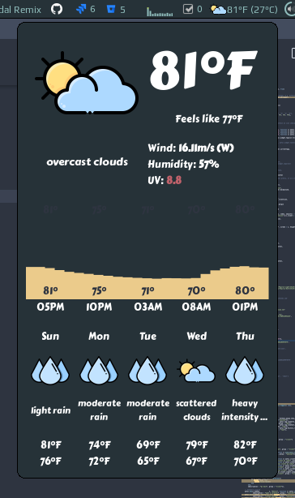
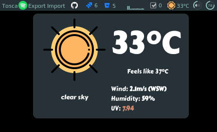
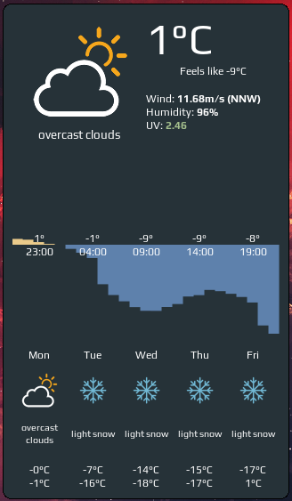

# Weather widget

<p align="center">
  <a href="https://github.com/streetturtle/awesome-wm-widgets/labels/weather" target="_blank"></a>
  
  <a href="https://twitter.com/intent/tweet?text=Check%20out%20this%20awesome%20weather%20widget%20for%20Awesome%20Window%20Manager%20&url=https://github.com/streetturtle/awesome-wm-widgets/blob/master/weather-widget" target="_blank">
  
   </a>
</p>

The widget showing current, hourly and daily weather forecast.

<p align="center">
 
</p>

The widget consists of three sections:
 - current weather, including humidity, wind speed, UV index
 - hourly forecast for the next 24 hours
 - daily forecast for the next five days

## Customization

It is possible to customize widget by providing a table with all or some of the following config parameters:

| Name | Default | Description |
|---|---|---|
| coordinates | Required | Table with two elements: latitude and longitude, e.g. `{46.204400, 6.143200}` | 
| api_key | Required | Get it [here](https://openweathermap.org/appid) |
| font_name | `beautiful.font:gsub("%s%d+$", "")` | **Name** of the font to use e.g. 'Play' |
| both_units_widget | false | Show temperature in both units - '28°C (83°F) |
| units | metric | `metric` for celsius, `imperial` for fahrenheit |
| show_hourly_forecast | false | Show hourly forecase section |
| time_format_12h |false | 12 or 24 hour format (13:00 - default or 1pm) |
| show_daily_forecast | false | Show daily forecast section |
| icon_pack_name | weather-underground-icons | Name of the icon pack, could be `weather-underground-icon` or `VitalyGorbachev` or create your own, more details below |
| icons_extension | `.png` | File extension of icons in the pack |
| timeout | 120 | How often in seconds the widget refreshes |

### Icons:

The widget comes with two predefined icon packs:

 - weather-underground-icons taken from [here](https://github.com/manifestinteractive/weather-underground-icons)
 - VitalyGorbachev taken from [here](https://www.flaticon.com/authors/vitaly-gorbachev)

To add your custom icons, create a folder with the pack name under `/icons` and use the folder name in widget's config. There should be 18 icons, preferably 128x128 minimum. Icons should also respect the naming convention, please check widget's source.

### Examples:

#### Custom font, icons



```lua
weather_curl_widget({
    api_key='<your-key>',
    coordinates = {45.5017, -73.5673},
    time_format_12h = true,
    units = 'imperial',
    both_units_widget = true,
    font_name = 'Carter One',
    icons = 'VitalyGorbachev',
    icons_extension = '.svg',
    show_hourly_forecast = true,
    show_daily_forecast = true,
}),
```

#### Only current weather



```lua
weather_curl_widget({
    api_key='<your-key>',
    coordinates = {45.5017, -73.5673},
}),
```

## Installation

1. Download json parser for lua from [github.com/rxi/json.lua](https://github.com/rxi/json.lua) and place it under **~/.config/awesome/** (don't forget to star a repo <i class="fa fa-github-alt"></i> ):

    ```bash
    wget -P ~/.config/awesome/ https://raw.githubusercontent.com/rxi/json.lua/master/json.lua
    ```

1. Clone this repo under **~/.config/awesome/**:

    ```bash
    git clone https://github.com/streetturtle/awesome-wm-widgets.git ~/.config/awesome/
    ```

1.  Get Open Weather Map app id here: [openweathermap.org/appid](https://openweathermap.org/appid).

1. Require weather widget at the beginning of **rc.lua**:

    ```lua
    local weather_widget = require("awesome-wm-widgets.weather-widget.weather")
    ```

1. Add widget to the tasklist:

    ```lua
    s.mytasklist, -- Middle widget
        { -- Right widgets
            layout = wibox.layout.fixed.horizontal,
            ...
            --default
            weather_widget({
                api_key='<your-key>',
                coordinates = {45.5017, -73.5673},
            }),
            ,
            --customized
            weather_curl_widget({
                api_key='<your-key>',
                coordinates = {45.5017, -73.5673},
                time_format_12h = true,
                units = 'imperial',
                both_units_widget = true,
                font_name = 'Carter One',
                icons = 'VitalyGorbachev',
                icons_extension = '.svg',
                show_hourly_forecast = true,
                show_daily_forecast = true,
            }),
            ...
    ```

## More screenshots

Only negative temperature:


Both positive and negative tempertature:



## How it works

TBW
